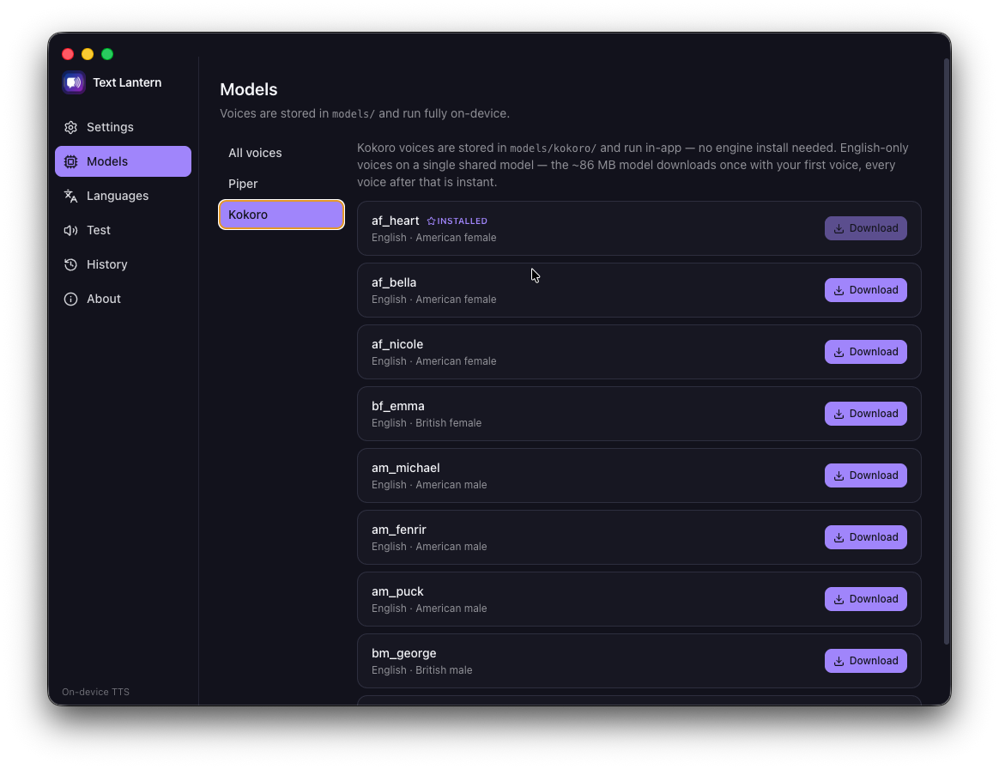
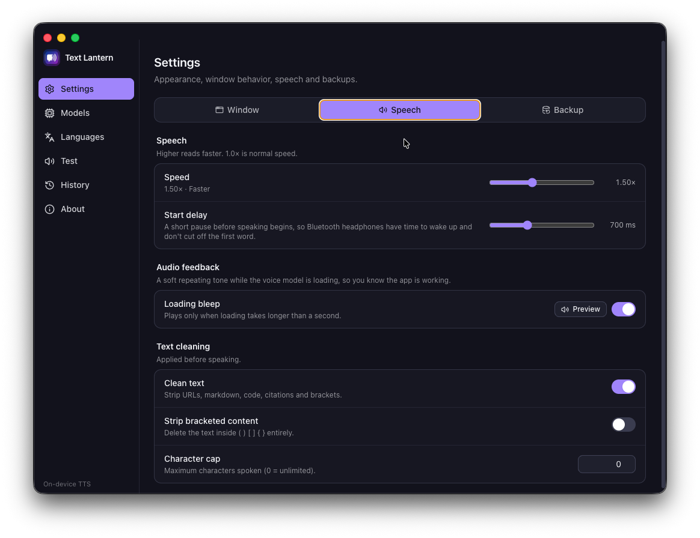
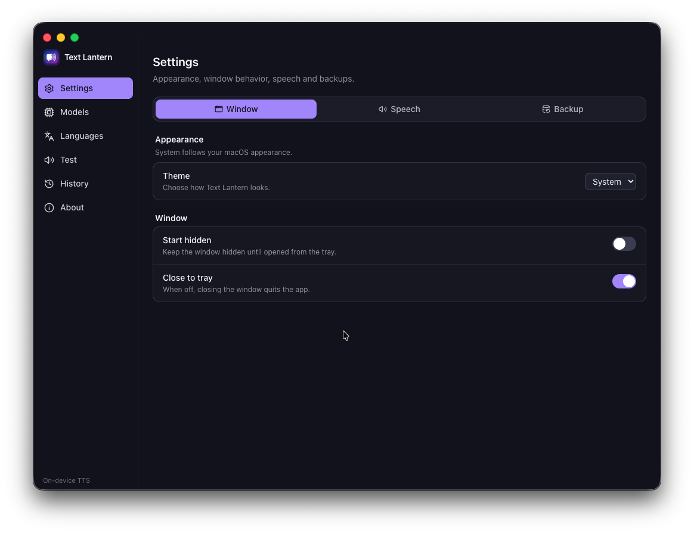
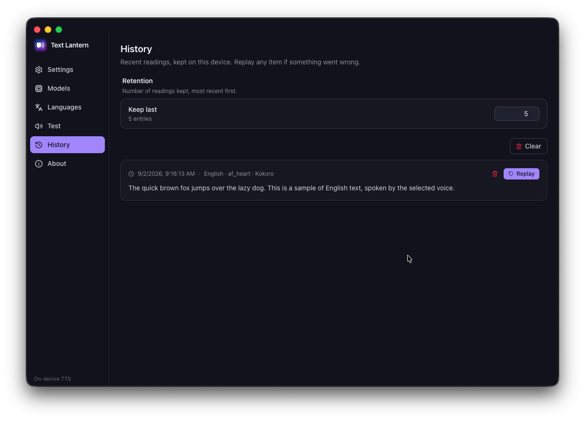

<p align="center">
  
</p>

<h1 align="center">Text Lantern</h1>

<p align="center">
  
  
  
  
</p>

<p align="center">
  Made by
  <a href="https://beecode.rs"></a>
  <a href="https://beecode.rs"><strong>Beecode</strong></a>
</p>

Text Lantern is a small Electron + TypeScript menu-bar app for macOS, Linux,
and Windows that reads the currently-selected text aloud through on-device
neural voices — nothing is sent to a server. It does 4 things:

- **Reads your selection aloud** — press a language's global shortcut (or
  auto-detect) and the app speaks the selected text.
- **Speaks many languages** — Serbian and English voices come configured, and
  any other Piper or Kokoro voice can be added in-app.
- **Runs fully on-device** — the Piper and Kokoro engines are installed and
  managed by the app itself; your text never leaves the machine.
- **Keeps your setup** — per-language voice, shortcut, and speed; reading
  history; and backup/restore of the whole configuration.

## Status: Proof of Concept

Text Lantern is at **v0.1.1** and still a proof of concept. It was built through rapid AI-assisted iteration ("vibe coding") rather than carefully reviewed engineering, so expect rough edges, missing pieces, and breaking changes without notice. While it remains a POC the version stays on `0.x`; the move out of the POC phase coincides with the major version moving to `1`.

## Screenshots

| [Languages](resource/docs/features.md#voices-and-languages) | [Installed voices](resource/docs/features.md#models-section) | [Piper search](resource/docs/features.md#models-section) |
| :---: | :---: | :---: |
| <a href="resource/screenshots/languages-global-shortcuts.png"></a> | <a href="resource/screenshots/models-all-voices.png"></a> | <a href="resource/screenshots/models-piper-search.png"></a> |

| [Kokoro voices](resource/docs/features.md#models-section) | [Speech](resource/docs/features.md#speech-settings) | [Window](resource/docs/features.md#window-settings) |
| :---: | :---: | :---: |
| <a href="resource/screenshots/models-kokoro.png"></a> | <a href="resource/screenshots/settings-spleech.png"></a> | <a href="resource/screenshots/settings-window.png"></a> |

| [History](resource/docs/features.md#history) |
| :---: |
| <a href="resource/screenshots/history.png"></a> |

The titles link to each feature's section in [resource/docs/features.md](resource/docs/features.md).

## Features

- **Menu-bar tray** — a reading-state icon and a menu with Read auto, one entry
  per configured language, Stop, Settings, and Quit.
- **Language bindings** — one row per language pairing it with the voice that
  reads it, a global shortcut, and its own speed, with conflicts flagged.
- **Auto-detect** — one shortcut detects the language of the selection and
  reads it with the matching binding's voice (a fallback covers unbound
  languages).
- **Voice management** — install the Piper engine, then search the Piper voice
  library, paste a voice file URL, pick favorites, or download Kokoro voices —
  all in-app.
- **Speech settings** — reading-speed multiplier, start delay for Bluetooth
  headphones, loading bleep, text-cleaning toggles, and a character cap.
- **Backup & restore** — export shortcuts, settings, and the voice list to a
  JSON file and restore from one; missing voices re-download automatically.
- **History** — recent readings with replay, per-item delete, and a retention
  limit.
- **Test & Now Playing** — audition voices on a test screen, with a Now Playing
  bar and Stop control while reading.

For a deeper look at each feature — settings, edge cases, and how things work under the hood — see [resource/docs/features.md](resource/docs/features.md).

## Feature status

Done:

- [x] TTS engines: Piper (Python venv, app-managed) and Kokoro (JavaScript)
- [x] Language bindings with per-language voice, speed, and global shortcut
- [x] Auto-detect language from the selected text (tinyld)
- [x] Text cleaner (URLs, markdown, code, citations, brackets)
- [x] Voice discovery & download from the Piper voice library
- [x] Reading history with replay and retention
- [x] Settings backup & restore (JSON export/import; missing voices re-download on restore)
- [x] Installable release builds (macOS dmg, Linux AppImage/deb, Windows exe via Releases)

Planned:

- [ ] Real selection grab on Linux and Windows (currently the clipboard is read as-is)
- [ ] Code signing (macOS/Windows installers are unsigned for now)

## Requirements

**To use the app:** a macOS, Linux, or Windows machine, plus:

- `python3` 3.9+ — only for the Piper engine, which the app installs into its
  private virtualenv. On Windows, install Python from python.org with "Add
  python.exe to PATH" checked; on Debian/Ubuntu, if the engine install fails,
  install the headers (`sudo apt install python3-venv espeak-ng-dev`) and retry
  from the Models section. Kokoro voices need no Python at all.
- Reading the selection is fully supported on macOS; on Linux and Windows the
  app reads the clipboard as-is when you press the shortcut (a real selection
  grab is planned — see [Feature status](#feature-status)).

**To build from source:** [Node.js](https://nodejs.org) (`^20.19 || >=22.12`,
22 LTS recommended — pinned in `.nvmrc`) and [pnpm](https://pnpm.io) (pinned
via `packageManager`).

## Download & install

Downloads live on the [GitHub Releases](https://github.com/beecode-rs/text-lantern/releases) page.

**macOS** (Apple Silicon & Intel, one universal build): download `Text-Lantern-<version>-universal.dmg` and drag **Text Lantern** to Applications.

> The release builds are not signed or notarized with an Apple developer certificate, so macOS blocks the first launch. That is standard macOS behavior for any unsigned app — it needs a one-time confirmation that you trust it:
>
> 1. Open **Text Lantern** once — it will be blocked with a "cannot be checked for malicious software" dialog. Dismiss the dialog.
> 2. Go to **System Settings → Privacy & Security** and scroll down to the Security section.
> 3. Under "'Text Lantern' was blocked from use because it is not notarized", click **Open Anyway** and confirm.

Alternatively, clear the quarantine flag from a Terminal:

```bash
xattr -cr '/Applications/Text Lantern.app'
```

**Ubuntu — AppImage**: make it executable and run it (no install needed):

```bash
chmod +x Text-Lantern-<version>.AppImage
./Text-Lantern-<version>.AppImage
```

**Ubuntu — deb package**:

```bash
sudo apt install ./text-lantern_<version>_amd64.deb
```

**Windows**: run `Text-Lantern-Setup-<version>.exe`. The installer is unsigned, so SmartScreen will warn — choose **More info → Run anyway**.

### From source

Requires [Node.js](https://nodejs.org) and [pnpm](https://pnpm.io).

```bash
git clone https://github.com/beecode-rs/text-lantern.git
cd text-lantern
pnpm install
pnpm dev
```

Node 22 is pinned in `.nvmrc` (`nvm use` or `fnm use` before installing). The full development setup lives in [resource/docs/development.md](resource/docs/development.md).

## Getting started

1. Launch **Text Lantern** — it lives in the menu bar.
2. On macOS, grant the app **Accessibility** permission (System Settings →
   Privacy & Security → Accessibility) so it can read your selection. The app
   sends a Cmd+C to copy the selected text; the clipboard is saved and
   restored around the grab, so your clipboard isn't disturbed.
3. Open the **Models** section and click **Install engine** — the app creates
   its private virtualenv, installs `piper-tts`, and downloads the default
   Serbian + English voices (you only need `python3` 3.9+ on your machine; the
   app does the rest). Voices and engines live in the app's userData folder,
   never inside the installation.
4. Select text anywhere and press a language shortcut — or the auto-detect
   shortcut — and the app reads it aloud.
5. Add more languages and voices as you go; see [Features](#features) for what
   is possible.

## Privacy & security

**The text you select and everything the app derives from it** stay on your device — text cleaning, language detection, and speech synthesis all run fully on-device, and nothing is sent anywhere. The app contains no analytics and no telemetry.

The app's only network use is downloading voices, engines, and models from Hugging Face when you request them in the Models section.

## Support & contributing

Found a bug or have an idea? Open an issue on [GitHub](https://github.com/beecode-rs/text-lantern/issues) — include the app version, your OS, and the steps to reproduce. Pull requests are welcome too; keep the [feature status](#feature-status) in mind, and open an issue before starting something large.

## For developers

The README covers using the app. To work on it:

- [Development setup](resource/docs/development.md) — prerequisites, daily commands, quality gates
- [Feature details](resource/docs/features.md) — engines, language bindings, cleaner, backup, history
- [Releasing](resource/docs/releasing.md) — tag-driven releases

## Acknowledgments

- [Piper](https://github.com/OHF-voice/piper1-gpl) — the neural TTS engine the app installs and manages (the `piper-tts` PyPI package) — [GPL-3.0](https://github.com/OHF-voice/piper1-gpl)
- [Kokoro](https://github.com/hexgrad/kokoro) & [kokoro-js](https://github.com/hexgrad/kokoro-js) — the Kokoro voices, their pure-JavaScript inference engine, and the shared ~88 MB model downloaded on first use — [Apache-2.0](https://github.com/hexgrad/kokoro)
- [phantom9623/piper-serbian-tts](https://huggingface.co/phantom9623/piper-serbian-tts) — the bundled default Serbian voice (`sr_Marko_medium`)
- [rhasspy/piper-voices](https://huggingface.co/rhasspy/piper-voices) — the bundled default English voice (`en_US-lessac-medium`) and the searchable Piper voice library
- [eSpeak NG](https://github.com/espeak-ng/espeak-ng) — phonemization inside Piper
- [tinyld](https://github.com/komodojp/tinyld) — language detection — [MIT](https://github.com/komodojp/tinyld)

## License

[MIT](LICENSE)
