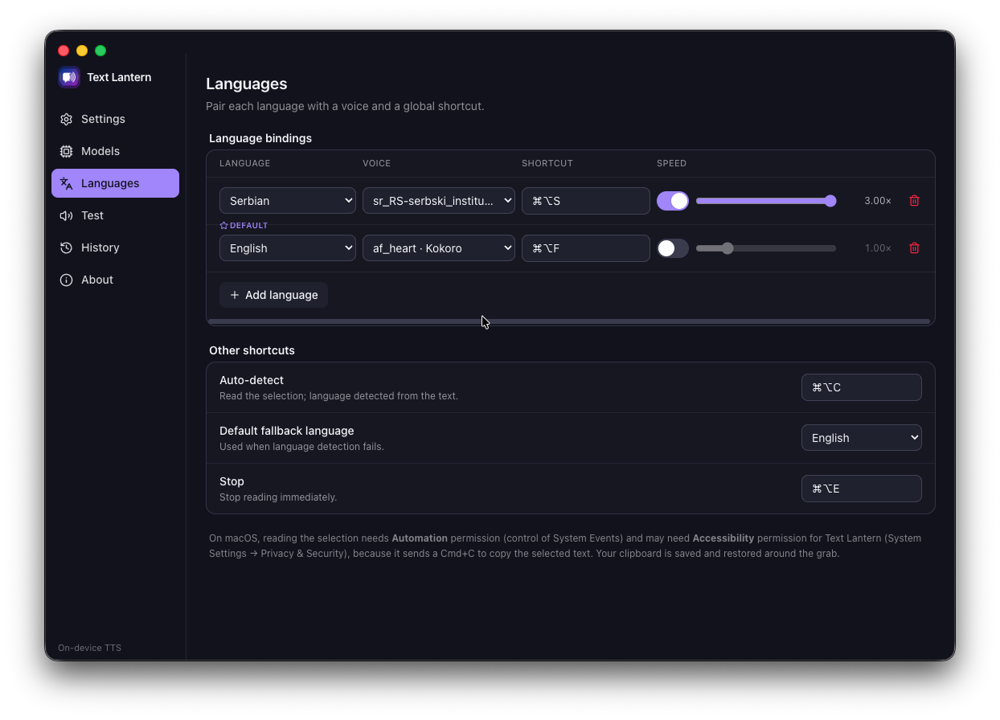
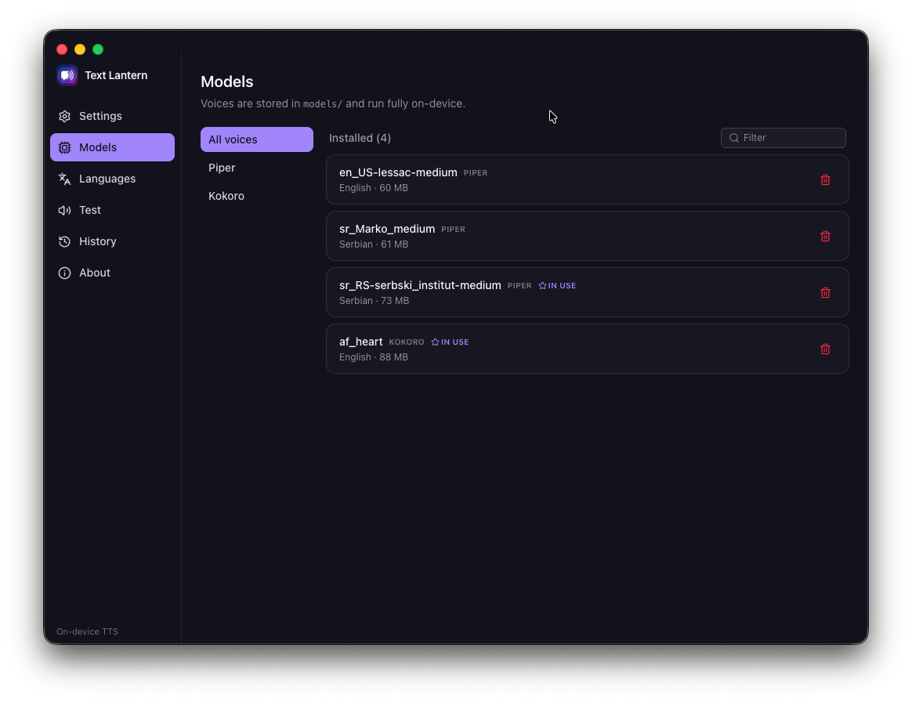
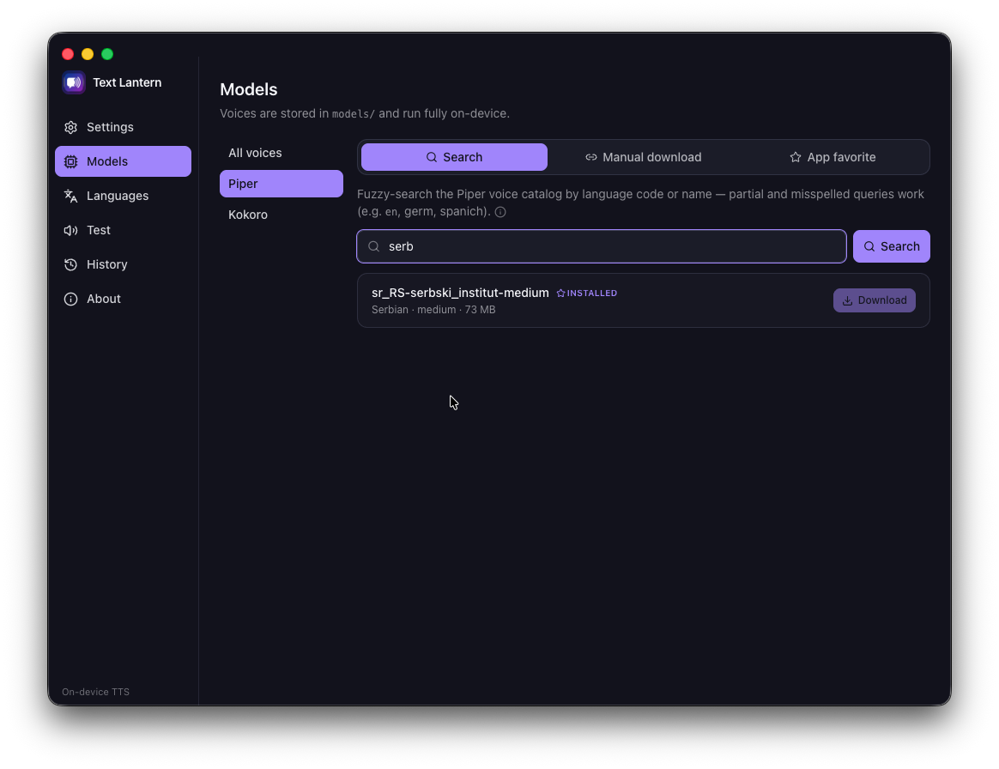

<p align="center">
  
</p>

<h1 align="center">Text Lantern</h1>

<p align="center">
  
  
  
</p>

A Handy-inspired, **menu-bar** desktop app (Electron + TypeScript, React + Tailwind
renderer) that reads the currently-selected text aloud. It speaks through two
on-device engines:

- **[Piper](https://github.com/rhasspy/piper)** neural voices — it ships with a
  **Serbian** voice ([phantom9623/piper-serbian-tts](https://huggingface.co/phantom9623/piper-serbian-tts),
  `sr_Marko_medium`) and a natural **English** voice (`en_US-lessac-medium`), and you
  can add any other Piper voice. The Python `piper-tts` engine is installed and
  managed by the app in a private virtualenv.
- **[Kokoro](https://github.com/hexgrad/kokoro)** (via `kokoro-js`) — pure-JavaScript
  inference, no Python needed; the model downloads on first use.

All of the app's logic — text cleaning, language detection, voice resolution,
voice download, engine install, and audio playback — lives in the TypeScript app
and runs fully on-device; nothing is sent anywhere. Both Cyrillic and Latin
Serbian input are supported by the Serbian voice.

## Status: Proof of Concept

Text Lantern is at **v0.1.0** and still a proof of concept. It was built through
rapid AI-assisted iteration ("vibe coding") rather than carefully reviewed
engineering, so expect rough edges, missing pieces, and breaking changes without
notice. While it remains a POC the version stays on `0.x`; the move out of the
POC phase coincides with the major version moving to `1`.

Platform status:

| | macOS | Linux | Windows |
|---|---|---|---|
| Installers | universal dmg | AppImage, deb | NSIS setup exe |
| Reading the selection | ✅ (simulates ⌘C) | ⚠️ reads the clipboard as-is | ⚠️ reads the clipboard as-is |
| Piper engine (Python) | ✅ | ✅ | best effort (needs `python` on PATH) |
| Kokoro engine (JavaScript) | ✅ | ✅ | ✅ |

## Download & install

Downloads live on the [Releases](https://gitea.bugarinovic.com/milos/text-lantern/releases)
page.

**macOS** (Apple Silicon & Intel, one universal build): download
`Text-Lantern-<version>-universal.dmg` and drag **Text Lantern** to Applications.
The app is unsigned, so macOS blocks the first launch — after one failed open
attempt, go to **System Settings → Privacy & Security → Open Anyway**, or clear
the quarantine flag from a Terminal:

```bash
xattr -cr '/Applications/Text Lantern.app'
```

Reading the selection also needs **Accessibility** permission for the app
(System Settings → Privacy & Security → Accessibility). The app sends a Cmd+C to
copy the selected text; the clipboard is saved and restored around the grab, so
your clipboard isn't disturbed.

**Ubuntu — AppImage**: make it executable and run it (no install needed):

```bash
chmod +x Text-Lantern-<version>.AppImage
./Text-Lantern-<version>.AppImage
```

**Ubuntu — deb package**:

```bash
sudo apt install ./text-lantern_<version>_amd64.deb
```

**Windows**: run `Text-Lantern-Setup-<version>.exe`. The installer is unsigned,
so SmartScreen will warn — choose **More info → Run anyway**. Reading the
selection is not implemented yet on Windows: the app reads whatever is in the
clipboard when you press the shortcut.

On first launch, **Settings → Models** shows the engines as not installed. Click
**Install engine** — the app creates the virtualenv, installs `piper-tts`, and
downloads the default Serbian + English voices (you only need `python3` 3.9+ on
your machine; the app does the rest). Voices and engines live in the app's
userData folder, never inside the installation.

## Features

- **Menu-bar tray** with a reading-state icon and a menu (Read auto, one entry per
  configured language, Stop, Settings, Quit).
- **Languages** (Settings → Languages): pair each language with the voice that reads
  it, a global shortcut, and a per-language speed — one row per language. Add any
  recognized language, pick its voice, and bind a hotkey; each language and each
  shortcut can be used only once, and conflicts are flagged. Auto-detect and Stop
  have their own shortcuts too.
- **Models** (Settings → Models): install the Piper engine, list installed voices,
  and download more — fuzzy-search the Piper voice library, paste a voice file URL,
  or pick from the app's curated favorites; browse downloadable Kokoro voices (one
  shared ~86 MB model). Voices used by a language are marked "in use".
- **Speech** (Settings → Speech): reading-speed multiplier, start delay (lets
  Bluetooth headphones wake before playback), loading bleep, text-cleaning toggles,
  and a character cap.
- **History**: recent readings with replay, per-item delete, and a retention limit.
- **Test** screen to audition voices, plus a **Now Playing** bar with a Stop button.

## Feature status

Done:

- [x] TTS engines: Piper (Python venv, app-managed) and Kokoro (JavaScript)
- [x] Language bindings with per-language voice, speed, and global shortcut
- [x] Auto-detect language from the selected text (tinyld)
- [x] Text cleaner (URLs, markdown, code, citations, brackets)
- [x] Voice discovery & download from the Piper voice library
- [x] Reading history with replay and retention
- [x] Installable release builds (macOS dmg, Linux AppImage/deb, Windows exe via Releases)

Planned:

- [ ] Real selection grab on Linux and Windows (currently the clipboard is read as-is)
- [ ] Code signing (macOS/Windows installers are unsigned for now)

## Screenshots

### Languages



One row per language: the voice that reads it, its global shortcut, and its own
speed slider. Serbian and English come configured; the default binding is used when
auto-detect finds no match. Auto-detect and Stop get their own shortcuts below.

### Models



Installed voices across both engines, filterable by All voices / Piper / Kokoro,
with in-use markers and per-voice delete.



Fuzzy-search the whole Piper voice library (here "serb" finds the
`sr_RS-serbski_institut-medium` Serbian voice), or switch to manual download by
voice file URL, or to the app's curated favorites.


Kokoro voices download in-app (one shared ~86 MB model) — no Python involved.

### Speech


Reading-speed multiplier, start delay for Bluetooth headphones, loading bleep,
text-cleaning toggles, and a character cap.

### Window


Theme and window behavior — start hidden, close to tray.

### History


Recent readings with replay and per-item delete; the retention stepper caps how
many entries are kept.

## Voices & languages

The app ships with two language bindings:

| Language | Default voice | Source |
|----------|---------------|--------|
| Serbian (`sr`) | `sr_Marko_medium` | phantom9623/piper-serbian-tts |
| English (`en`) | `en_US-lessac-medium` | rhasspy/piper-voices |

In **Settings → Languages** each language is one row: choose the voice that reads it
and the global shortcut that triggers reading. Add any recognized language (the full
list lives in `src/shared/languages.ts`), then pair it with an installed voice. Each
language and each shortcut may be used only once.

**Auto-detect** (its own shortcut, and the tray's default action) detects the language
from the selected text and reads it with the matching binding's voice; when the
detected language has no binding, the first binding is used.

**Add more voices** (any from [rhasspy/piper-voices](https://huggingface.co/rhasspy/piper-voices))
in Settings → Models, e.g. `en_US-ryan-high` (male), `en_US-amy-medium` (female),
`en_GB-cori-high` (British). Some natural English options: `en_US-lessac-medium`
(default), `en_US-ryan-high` (male), `en_US-amy-medium` (female),
`en_GB-cori-high` (British), `en_GB-alan-medium` (male, British).

### Adding custom languages (environment variable)

Extend the list of **recognized languages** shown in the UI via the `languages`
environment variable, whose value is a JSON array of `{ code, name }` objects.

```json
[
  {"code": "hr", "name": "Croatian"},
  {"code": "sl", "name": "Slovenian"},
  {"code": "en", "name": "American English"}
]
```

- **Existing code** → its display **name is overridden** (above, `en` becomes
  "American English"); the code is not duplicated and keeps its position.
- **New code** → **appended** to the end of the list. Codes stay unique.
- Codes are **case-normalized to lowercase**; each entry needs a non-empty
  `code` and `name`, otherwise it is skipped.
- If `languages` is **unset or the JSON is invalid**, the built-in list is used
  unchanged (invalid JSON also logs a warning to the console).

Set it inline before launching, or `export` it in your shell:

```bash
languages='[{"code":"hr","name":"Croatian"}]' pnpm dev
languages='[{"code":"hr","name":"Croatian"}]' pnpm build
```

For a packaged build, set `languages` in the process environment the same way.

> **Note:** listing a language does **not** install a voice. Whether a Piper
> voice exists for a code is resolved at runtime from installed/downloaded
> voices (Settings → Models). Add `{"code":"hr","name":"Croatian"}` and Croatian
> appears in the list, but you still need to download a Croatian voice for it to
> speak.

### What the cleaner removes

Before speaking, the text is cleaned (toggles in Settings → Speech):

- URLs (`https://…`, `www.…`, `example.com/path`) and e-mail addresses
- Markdown: `[text](url)` → `text`, images `` gone, `**bold**`/`__u__`/`~~s~~`
  stripped, headings & list markers dropped
- Inline and fenced code blocks
- Citation / reference markers (`[1]`, `[12, p. 3]`, `[citation needed]`)
- HTML tags
- Bracket characters `()[]{}` — by default the inner text is kept; *Strip bracket
  content* deletes the content too
- Extra whitespace and space-before-punctuation

### Speed / prosody

Speech speed (Settings → Speech) is a reading-speed multiplier: `2.0` reads twice as
fast, `1.0` is normal, `0.5` half speed. It is inverted to Piper's
`--length-scale` (`1 / speed`) at the engine.

## Requirements

For **development**:

- **Node.js** `^20.19 || >=22.12` (Node 22 LTS recommended) — required to run the
  dev server and build. `electron-vite` uses Vite 7, which needs this Node range.
  Older Node (e.g. 18) fails to start the dev server with
  `TypeError: crypto.hash is not a function`. The project pins this via an
  `.nvmrc`; with [fnm](https://github.com/Schniz/fnm) or
  [nvm](https://github.com/nvm-sh/nvm), switch to it before installing:

  ```bash
  fnm use            # or: nvm use   (reads .nvmrc → Node 22)
  fnm install 22     # one-time, if you don't already have Node 22
  ```
- **pnpm** (`pnpm-lock.yaml`; `packageManager` pinned to `pnpm@10.23.0`) — install
  via [Corepack](https://nodejs.org/api/corepack.html) (`corepack enable`) or
  [standalone](https://pnpm.io/installation). **npm and yarn are blocked** by a
  `preinstall` guard; always use `pnpm install`.

At **runtime** (the installed app):

- **python3** 3.9+ — only for the Piper engine, which the app installs into its
  private virtualenv. On Debian/Ubuntu, if the engine install fails, install the
  headers (`sudo apt install python3-venv espeak-ng-dev`) and retry from
  Settings → Models. On Windows, install Python from python.org with
  "Add python.exe to PATH" checked. The Kokoro engine needs no Python at all.
- macOS for full selection support (see the platform table above).

## Development

```bash
git clone <repo-url>
cd text-lantern
nvm use                                  # switch to Node 22 (pinned in .nvmrc)
pnpm install                             # installs deps + downloads the Electron binary
pnpm dev                                 # launch with hot reload
```

> The Electron binary downloads automatically during `pnpm install` (the
> `postinstall` script runs Electron's installer explicitly). If `pnpm install`
> was ever run on an older Node and you see `Error: Electron uninstall`,
> re-run it on Node 22, or fetch the binary directly:
> `node node_modules/electron/install.js`.

Other scripts:

- `pnpm build` — build main/preload/renderer into `out/`
- `pnpm start` — run the built app
- `pnpm typecheck` — typecheck the node and web projects
- `pnpm lint` / `pnpm lint-fix` — ESLint + Prettier + json-sort-cli
- `pnpm dist:mac` / `pnpm dist:linux` / `pnpm dist:win` — build installers into
  `dist/` (universal dmg; AppImage + deb; NSIS exe)
- `pnpm pack:dir` — unpacked build into `dist/` for a quick local smoke test

### Releasing

Releases are tag-driven. From `main` (after merging what you want to ship):

```bash
pnpm release:patch   # or release:minor / release:major
```

That bumps `package.json`, commits, tags `v<version>`, and pushes. GitHub Actions
then runs the quality gate (typecheck, lint), builds the macOS, Linux, and Windows
installers — failing if the tag does not match the package version — and publishes
them to the [Releases](https://gitea.bugarinovic.com/milos/text-lantern/releases)
page with auto-generated notes. The workflow can also be run manually
("Run workflow") as a dry run that builds everything without creating a release.

## Project layout

```
text-lantern/
├── src/                # the Electron app (all logic lives here)
│   ├── main/           # Node main process: tts, models, ipc, settings, shortcuts, tray
│   ├── preload/        # contextBridge API
│   ├── renderer/       # React + Tailwind UI
│   └── shared/         # types shared across processes
├── build/              # electron-builder icons (regenerate: resource/script/generate-build-icons.cjs)
├── resource/           # app icon, piper server script, reference material
├── models/             # *.onnx + *.onnx.json voices (dev only, app-managed)
└── bin/venv/           # piper-tts engine (dev only, created by the app)
```

In an installed app, `models/` and `bin/venv/` live under the OS userData folder
(`~/Library/Application Support/Text Lantern` on macOS) — never inside the
installation, so they survive updates.

## Credits

- Serbian voice: [`phantom9623/piper-serbian-tts`](https://huggingface.co/phantom9623/piper-serbian-tts)
- English voice & extras: [rhasspy/piper-voices](https://huggingface.co/rhasspy/piper-voices)
- Engine: [Piper](https://github.com/OHF-voice/piper1-gpl) (via the `piper-tts` PyPI package, GPL-3.0)
- Kokoro engine: [kokoro-js](https://github.com/hexgrad/kokoro-js) (Apache-2.0)
- Phonemization: [eSpeak NG](https://github.com/espeak-ng/espeak-ng)
- Language detection: [tinyld](https://github.com/komodojp/tinyld)

## License

[MIT](LICENSE)
